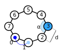
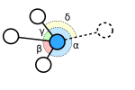
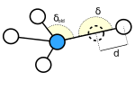

# Self-replicating machines

#### Abstract

There are several ways to create self-replicating structures. In this article, machines with the ability to self-replicate by inspection will be described. On the one hand they need a mechanism to read out their own structure and internal states and, on the other hand, they also require an apparatus to replicate them.

## Cell skeleton

We build our self-replicating machine as a simple loop. A more complicated topology is of course also conceivable, but not relevant for our rather minimal example. In general, replication costs energy and since energy conservation must be satisfied in ALIEN, in addition to the ability to self-replicate, we also need simple movement and digestion functionality so that sufficient energy can be provided.

A possible basic framework is shown above. At the front (right) is a cell with attack capabilities and at the sides are muscle units to accelerate in the respective direction. For simplicity, we will implement a straight ahead movement pattern. At the back (left) we attach a scanner cell to read out the inner structure and a constructor cell to rebuild the extracted information. The challenge here is that we have a variety of cell types and we need to provide them with the appropriate information using the computational cells.

In the ALIEN editor, our self-replicator then looks like this:

In the following, we will first explain the two new cell types (Scanner and Constructor) and then discuss the data supply.

## Working principle of a scanner cell

A scanner cell can read the internal state and the angles and distances of the reference configuration to another cell in the cell cluster. For this purpose, the scanner cell numbers all the cells in the cluster starting from itself according to the specified order. If one wants to read out a cell in the cluster, one has to tell the scanner cell the corresponding number. Cells are numbered in a spiraling counterclockwise fashion around the scanner cell. A few examples illustrate the numbering algorithm:

In this example, the scanner cell is on the blue token that comes from the left neighboring cell. The scanner cell itself is numbered with 0 and the cell where the token comes from with 1. Afterwards the further cells are numbered counterclockwise in ascending order.


The numbering shown here has nothing to do with the token branch numbers of the cells.


However, in this example, the cell cluster is not completely covered by the numbering algorithm,

For our replicator, the resulting numbering of the cells is relatively simple. With the help of this (relative) numbering, the scanner cell can now be provided with a number indicating for which cell in the cluster the information should be read out.

Let us assume we want to read the cell with the number `n`. The scanner cell then provides the following information as output:

* The reference distance of cell `n` from cell `n-1`.
* The reference angle between the two cell connections of cells `n` and `n-1` and cells `n` and `n+1`.
* Internal state of cell `n` including energy, maximal connection, branch number, color, cell specialization und cell memories.


It should be noted that only the cell connection information to the predecessor and successor cells are retrieved. Other possible cell connections are not read out. We will see in the next section that this information is nevertheless usually sufficient to rebuild even more complex topologies than simple loops.


For example, suppose that we want to scan the cell with number 3 in our replicator above. We would then obtain the (reference) distance `d` and angle `α` as follows:

There are a few special cases:

* When reading out the cell with number 0, no distance and angle information are returned.
* The cell with the largest number is read, i.e. there is no successor cell: In this case, no angle information is supplied and the reaching of the end is reported.
* If the number of the cell to be read in does not exist, a reaching of the end is also returned.

## Working principle of a construction cell

A construction cell is, in a sense, the counterpart to a scanner cell. It can use the information provided by the scanner cell to build a replica of the scanned cell. It is, of course, also possible to provide completely new construction information through preceding computational cells. A construction cell can only create one new cell per invocation at most. Consequently, in order to create a complete cell cluster including its connections, the construction cell must be called several times. Such a cluster construction process follows a 3 stage pattern, which we will discuss below.

#### 1. Create a construction site

In this case, we assume that we have not yet created a cell or, more precisely, none of the created cells is still connected to the construction cell. The goal is here to create a new adjacent cell which will be connected to the construction cell (if desired). This requires an angle specification and the internal state of the new cell. The exact spatial position then results as follows:

* First of all, two successive cell connections of the construction cell are searched for, which have the largest angle to each other. The new cell is then created with the specified angle in this area (see illustration below).
* The distance from the construction cell is a fixed value and cannot be adjusted.

In the above illustration, the blue construction cell is already connected to 3 other cells. The angles between the connections there are labeled as `α`, `β` and `γ`, of which `α` is the largest. Therefore, the new cell is created in the neighborhood to the angle `α`. The angle `δ` is passed to the construction cell and thus defines the exact angle position.


The above angle calculation refers to the reference angles and not to the actual spatial angles.


In order for the newly created cell to be recognized as a _construction site_ in the further process, it is marked in a certain way. For this purpose, the _block token_ flag is on that cell. It also causes that this cell cannot accept tokens.

#### 2. Continue a construction

Here it is assumed that a construction site already exists, i.e., that at least one cell connected to the construction cell has the _block token_ flag set. The new cell is created between the construction cell and the cell representing the construction site. The angle to the construction site is preserved and denoted by `δ_old` in the illustration (and identical to `δ` from the 1st step).

The situation with the angle between the two connections of the new cell is a bit more complicated. The actual spatial angle is 180 degree, but the reference angle is set to `δ`, which is the angle passed to the construction cell beforehand. The difference between the reference angle and the actual spatial angle results in forces on the cells that move them to the desired positions after a few time steps.

The distance between the new cell and the cell of the construction site is denoted by `d` and handed over to the construction cell. Here, the actual spatial distance equals the reference distance.

If there are other cells in the immediate vicinity of the newly created cell, they will be connected to each other. In this way, a more complex cell cluster can be reproduced. The reference angles and distances required for the further connections are calculated from the spatial conditions and cannot be handed over. However, it is possible to project the reference angles to an integer multiple of, for example, 60 or 90 degrees in order to be able to control the angles of the additional connections.

