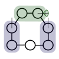
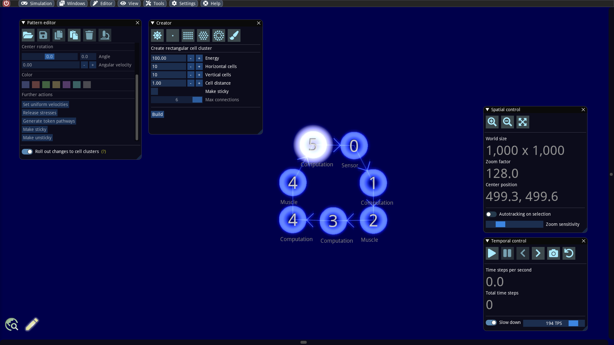
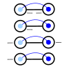
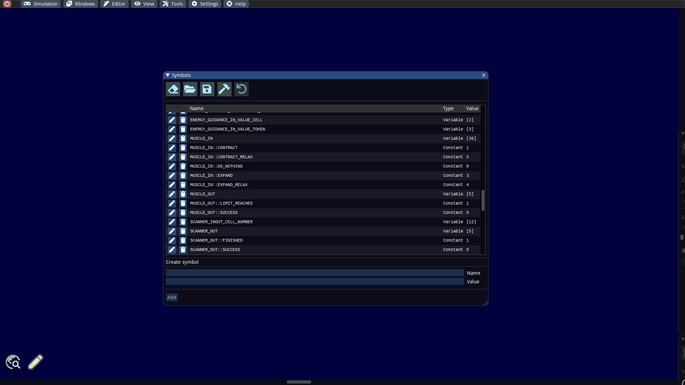
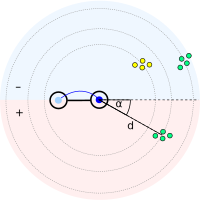

# Simple swarmbot

#### Abstract

Cells in ALIEN can perform a wide variety of actions. We will address mass sensors and motion control in this section. These functions will be explained by building a simple swarm robot that scans its environment for particle concentrations with a specific color and moves in that direction.

## Build a cell skeleton

The basic idea is that our swarmbot scans its environment for certain particle concentrations and as soon as it finds something, it heads for the target. If the target is on the left side, a forward movement combined with a left turn should take place and in the other case a right turn.

A simple skeleton for our purpose consists of a loop-shaped structure in which a token can circulate. In this structure, we need a _muscle_ on both sides that provides us with an impulse depending on the direction we want to direct. We also need to accommodate a sensor that will give us the distance and angle where particle concentrations of a certain color are located.



The above structure is composed of 7 cells and consists of 3 functional units:

* The 2 cells on the left side are used to generate an impulse to steer to the right. One of these cells is a computational cell and is used to control the muscle cells. A muscle cell can only generate an impulse in the direction or opposite direction from which the token originates.
* We still need a similar unit on the right side. A forward impulse on the right side leads to a left steering of the total structure.
* In front of the swarmbot is our visual unit. It consists of a computational cell and a mass sensor.

We now construct the basic structure in the editor by creating 7 cells and connecting them individually. Because there are only 6 different token branch numbers, it is not possible to reproduce a directed cycle. Here we will help later with a special cell program. Furthermore, we create a token at an arbitrary cell. To this end, we inspect one of these cells in the pattern editor (shortcut ALT+N) and click on the tab with the plus symbol.



We set the cell specializations (_Computation_, _Muscle_ and _Sensor_) as indicated in the screenshot above. They will be explained in detail in the following sections.&#x20;

## Working principle of a muscle cell

Muscle cells can perform 4 different operations. The reference distance of the muscle cell to the predecessor cell is changed and, if necessary, an impulse is generated at the same time. The predecessor cell designates the cell from which the token originates that has just entered the muscle cell.



The graphic above illustrates the different operations. Here we have two connected cells (a computation cell on the left and a muscle cell on the right) and a token that jumps from the left to the right cell and thus triggers the muscle function.

* The first operation refers to a pure contraction. Here, the reference distance of the cell connections is reduced by a fixed factor. This results in a force that brings the cells closer together.
* In the second case, the reference distance is also reduced and at the same time the muscle cell is given a forward momentum.
* The third operation describes a pure expansion. The distance between the connected cells is increased.
* Analogous to the second case, the fourth operation leads to an increase in distance and, at the same time, to a backward momentum of the muscle cell.

The indication of which operation should be performed is specified in the token memory. To simplify programming, there are default symbols for the memory location and its values. These can be viewed in the symbol editor, which can be opened in the editor menu.



The symbol `MUSCLE_IN` __ denotes the memory cell in the token where the muscle cell reads the operation. The different operations, on the other hand, are encoded via the symbols `MUSCLE_IN::CONTRACT_RELAX`, `MUSCLE_IN::CONTRACT`, `MUSCLE_IN::EXPAND_RELAX`, `MUSCLE_IN::EXPAND` in the above order. These simply refer to constant values.

For example, if we want the muscle cell to perform a contraction, we must set the appropriate value in the token memory beforehand. There the following command in a preceding computation cell we do.

```
mov MUSCLE_IN, MUSCLE_IN::CONTRACT_RELAX
```

## Implementation of a muscle control

In the following we will focus on the concrete implementation. To control the muscles for our swarmbot, we need the following cell programs:


Let us have a closer look at the cell program on the right side first:

```
mov j, SENSOR_OUT
add SENSOR_INOUT_ANGLE, 64
mov MUSCLE_IN, MUSCLE_IN::DO_NOTHING
if i=1
  mov MUSCLE_IN, MUSCLE_IN::CONTRACT_RELAX
  mov i, 3
endif
if i=0
  if j=SENSOR_OUT::CLUSTER_FOUND
    if SENSOR_INOUT_ANGLE>128
      mov MUSCLE_IN, MUSCLE_IN::EXPAND
      mov i, 1
    endif
  endif
endif
```

* Line 1: The memory cell which contains the return value from the sensor is stored in another memory cell with the symbol `j`. This is necessary because different cell functions sometimes use the same memory cell as output.
* Line 2: An angle correction of sensor data is performed here. We will examine this in more detail in the next section.
* Line 3: As default, we instruct the muscle cell to do nothing. This will always be the case when the sensor finds nothing.
* Line 8 - 15: It is checked whether the memory cell `i` is equal to `0`. This is the case if no muscle operations were performed in the last cycle. It is then checked whether the sensor has found something and whether the target is on the left side (with respect to the orientation in the picture above). The muscle cell on the right hand side is instructed to perform an expansion together with a backward momentum, which will cause the swarmbot to turn left. The memory cell `i` is set to `1` to perform a contraction in the next cycle.
* Line 4 - 7: The memory cell `i` is equal to `1` if an expansion was instructed in the last cycle. In order for the cell connection to regain its original reference distance, a contraction without an additional momentum is now instructed.

The program of the computation cell on the left side works analogously with the difference that here a forward momentum must be generated to initiate a clockwise rotation. This is due to the fact that the token reaches the muscle cell from below while in the right side it reaches the muscle cell from above.

```
mov BRANCH_NUMBER, 3
mov MUSCLE_IN, MUSCLE_IN::DO_NOTHING
if i=2
  mov MUSCLE_IN, MUSCLE_IN::EXPAND_RELAX
  mov i, 3
endif
if i=0
  if j=SENSOR_OUT::CLUSTER_FOUND
    if SENSOR_INOUT_ANGLE<128
      mov MUSCLE_IN, MUSCLE_IN::CONTRACT
      mov i, 2
    endif
  endif
endif
```

* Line 1: Here a new branch number is assigned to the token. Normally the token obtains the branch number of the underlying cell. However, in our case we want the token to jump from the cell with the number 4 to the cell above with the same number. Since tokens always jump to the cells with the next higher number, we have to set the branch number of the token to 3.
* Line 2 - 14: The code works similarly to the previous one with the difference that we first perform a contraction and then an expansion. Since this results in a right turn, this operation is only performed when the sensor has found a target on the right side.

Our machine would not work properly yet. For this we still need to adjust the sensor appropriately.

## Working principle of a sensor cell

A cell with a sensor is able to detect particle concentrations with a certain minimum density and a certain color in the vicinity. It will return the relative distance and relative angle of the found target. If it finds multiple targets, the one with the smallest distance is considered. Let us illustrate the working with a simple example.


