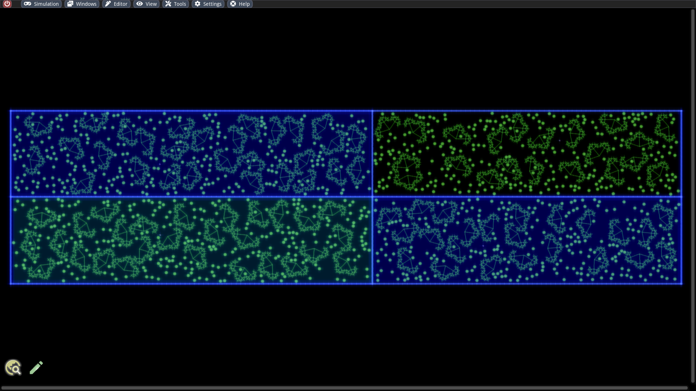

# Evolution simulations

#### Abstract

We will perform evolutionary simulations by injecting self-replicating machines into pristine worlds. Mutations will lead to gradual optimizations of the individuals. In this context, we want discuss the influence of crucial simulation parameters on cell functions. ALIEN offers several features for changing simulation parameters, which we will also make use of. We will also address how larger self-replicating machines can be made functioning and barriers can be used.

## Simple simulation setup for small self-replicators

The basic idea is simple: We create an empty world, fill it with enough particles serving as food source, inject a self-replicating machine and activate occasional mutations. The rest is done by the ongoing simulation.

To this end, we create a new simulation with the size 1000 x 500, fill it with enough particles (80,000 should be sufficient) and load the pattern `./examples/patterns/replicators/Loop.sim` into the world. This self-replicating structure has a loop shape, can move randomly, eat other particles to obtain energy from its environment and copy itself by inspecting its own structure to rebuild it. Alternatively, one can also load the ready-made simulation file `./examples/simulations/evolution/Loops.sim`.

Can you find the little particle machine right away?

Let us take a closer look at the loop and inspect its computation cells:

The cell cluster consists of 2 muscle cells for movement, a scanner cell for reading out the internal structure, a digestion cell for transforming surrounding particles into internal energy, a construction cell for creating new particles and several computational cells that are used for coordination. The exact replication process will be discussed in a later article. The cell code is also shown in the inspected cells.

In our first experiment we use almost the default settings for the simulation parameters except for:

* _Radiation strength_: 0
* _Cell mutation rate_: 0.0000016
* _Token mutation rate_: 0.0005

The cell mutation rate indicates the probability with which a byte of the cell memory including instructions or other properties (e.g. specialization, color, etc.) are randomly changed per time step. The analog setting is also available for the tokens.

If we now run the simulation for a few minutes, our world already does not look that idyllic anymore. The replicators have then eaten up most of the free resources and are now increasingly competing with each others.

If you let the simulation run even longer, mutations are increasingly created that multiply faster or move differently. The color also changes more or less randomly. An example of a longer simulation run can be found in the file `./examples/simulations/evolution/Loops Evolved.sim`.


One way to increase the simulation speed is to disable _Render simulation_ in the _View_ menu.


After some time one can experiment with the simulation parameters. For example, we can increase the mutation rates, or make the world more hostile to life by increasing the radiation. If one does not overdo it, the population should be able to adapt. A good possibility for the control offers the statistics window which can be activated in the _Window_ menu. It shows the total number of tokens in the world, which in turn is a measure of the cell activities. If this value falls too fast, then there is a danger that the population will die out.

## Simulations with larger self-replicators

In our last example, we initially started with replicators of nearly minimal size, although even smaller structures with certain functional trade-offs are conceivable. Somewhat more exciting and challenging are experiments with self-replicating machines, which are larger and consist of a more complex particle network. The copying process will take longer and we have to replicate particles with more connections. Furthermore, the sensitivity with respect to the simulation parameters requires a precise tuning. A significant advantage, however, is that larger structures can accommodate more functionality and that the optimization potential in evolutionary simulations is generally greater.

As in the previous section, we can build our own world and inject a large replicator. The pattern `./examples/patterns/replicators/Hexogon.sim` is available for this purpose. There are a few things to keep in mind here:

* One must be careful to distribute the food properly, because this machine needs longer for movement maneuvers. It is a good idea to place many small square cell clusters.
* One should also have several copies of the hexagon ready at the beginning because unfortunate coincidences can damage some.
* Larger cell clusters are significantly more susceptible to mutations. We should set the mutation rates very low at the beginning. For instance, a cell mutation rate of 0.000001 and a token mutation rate of 0.0001 should work.

There is also a readymade simulation for it, where all parameters are tuned and the food sources are distributed: `./examples/simulations/evolution/Hexagons.sim`

In contrast to the loop replicator, this one also has a sensor cell. This machine uses it to locate food sources and to control its muscle cells such that it moves there. However, due to its size, this navigation takes a very long time.&#x20;

Once we have assembled or loaded our world, we can start the simulation. As it can be noticed, we have to run the simulation much longer to have all the free food sources used up and to have the world filled with replicators. However, if we wait sufficiently long, we notice that at some point mutations arise that can multiply much more efficiently.

Have fun watching it!

## Colored cell types

It can be observed that after some time a certain equilibrium develops. The population size remains roughly stable, gradually fewer traits are changing and evolutionary leaps become rarer. One way of regularly breaking through equilibria and creating more refuge areas is to assign special importance to the color flavor of the cell. There exist two simulation parameters with which one can give the cell color a stronger meaning:

* _Target color mismatch penalty_: A target color can be set in the token memory for each digestion process, but it is ignored in the default settings. If this parameter is set greater than 0, the cell can extract less energy from another cell if it does not match the specified color. If this value is above 1, the cell actually loses energy during the digestion process if there is a color mismatch. This parameter can be used to exert selection pressure on the population, favoring those individuals that find and digest the particles with the matching color. At the same time, other populations can protect themselves from attacks by exhibiting a different color. This allows, for example, several populations with different colors to coexist peacefully.
* _Successive color dominance_: This parameter compares the color of the attacking with the attacked cell and establishes cyclic pattern of superiority. There are 7 different color flavors in ALIEN. If this parameter is greater than 0, a cell can get more energy from the digestion process if it has the next higher color value (in the MOD 7 sense) than the attacked cell. The idea behind this is that once a population with a certain color has become established, a color mutation that leads to the expression of individuals with the next higher color will have a selection advantage. It will prevail in the long run and in this process it will also be able to accumulate further mutations. Since this process can be repeated endlessly, there is a possibility of permanent change.

The parameters are explored in more detail in the article for [Attack functions](cell-programming/attack-functions.md). The statistics window gives us a good overview of the different cell colors. One has to invoke the plus button next to the cell diagram to obtain the number of cells broken down by color. In the following screenshot from a long simulation run we can see clearly how populations with certain colors have dominated at different time epochs.


Small populations can sometimes fail to survive the pressure to adapt. In order to prevent this as far as possible, the world including the population can be enlarged using the [Scaling function](../getting-started/scaling-functions.md).


## Inhomogeneous simulation parameters

An interesting way to construct more dynamic worlds is to specify regions with different simulation parameters. We can utilize this feature for evolution simulations, for example, by separating two parts of an elongated world by vertical zones with high friction. One can use the simulation file `./examples/simulations/evolution/Loops.sim` mentioned at the beginning, scale it by twice the length and then set up two high friction zones with values around 0.1 and a smooth transition in the simulation parameters window. We end up with two ecosystems that are almost, but not quite, separated.

Another possibility to model external influences and regular disturbances is to let the parameters change automatically in time. This functionality can also be enabled in the simulation parameters window with the toggle _Change automatically_. The parameters are then not only periodically varied, but the population size based on the number of tokens is continuously monitored and the parameters are restored if necessary.

## Separating populations with barriers

Since ALIEN version 3.1 it is possible to set up barriers. These are realized by special cells that are indestructible and immovable. They allow us to partly or completely separate populations. In combination with spatially different simulation parameters, interesting evolution simulations can be performed. We can divide our experiment into three phases:

#### 1. Initial Phase

We hereby create a world containing different (e.g. rectangular) areas surrounded by barriers. Barriers can be created in the _Creator_ window by activating the _Barrier_ checkbox. In the individual chambers we can then set simulation parameter spots with identical values (for now). We then place self-replicators and nutrients in each chambers. If one likes to cheat, it is possible to load the simulation `./examples/simulations/evolution/Multiverse.sim` where everything is already prepared. Much more interesting designs with labyrinth structures are also conceivable.

We now start the simulation and let the replicators multiply undisturbed.

#### 2. Diverge simulation parameters

Once the world has filled up with self-replicators, we can start varying the simulation parameters in each chamber. This should happen slowly and in many steps so that the population has time to adapt through mutations. A few suggestions for consideration:

* A high friction factor creates an evolutionary pressure to develop stronger movements.
* A high energy cost on digestion favors individuals that are more sparing with attacks.
* A high value for _Target mismatch penalty_ prefers individuals that pick out food with certain color.
* A low value for _Binding max energy_ destroys individuals that consume too much energy.


The conditions should diverge in the sense that individuals can only survive in their own chamber in the long term.


#### 3. Enable material exchange

Finally, we can install small openings between the individual chambers, so that some material exchange is possible. The populations can now interact. The fact that each population is best adapted to its own chambers reduces the risk that it will wipe out the others.

