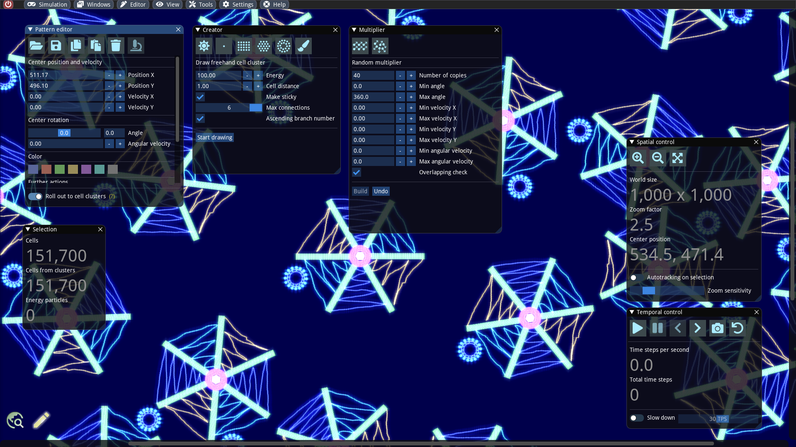

# Construct simple worlds

#### Abstract

The aim here is to learn how to create own worlds filled with different colored bodies consisting of simple geometric shapes and freehand drawings. We will also make use of predefined patterns. While doing so, we will familiarize ourselves with a multiplication function that allows us to mass-copy arbitrary patterns with adjustable randomness.

## Start with an empty world

The first step for our own world is to create a new empty world via the _Simulation_ menu and then _New_. In the dialog we can set the dimensions and adopt the simulation parameters and symbols from the previous simulation. A dimension of 1000 x 1000 units is sufficient for our purposes for now. Furthermore, we set the settings to default by not adopting them.


Please note that the length units do not represent pixels in the strict sense. The world is treated as a continuum. A length unit is rendered as one pixel at a zoom level of 1.0.



It is also possible to resize a world afterwards. For this purpose there is a resize function in the _Spatial control_ window. We will explain this in a later article in more detail.


Then we open the simulation parameters window and set the _Radiation strength_ to 0, so that our constructions will last for a long time.

## Create cell clusters

We open the _Creator_ via the _Editor_ menu. This window provides various tools with which new cell structures can be created. It is recommended to try all functions in sequence:

* Create single energy particle
* Create single cell
* Create rectangular cell cluster
* Create hexagonal cell cluster
* Create disc-shaped cell cluster
* Draw freehand cell cluster

Except for the freehand drawings, all constructions work the same way: One sets the properties in advance (e.g. the dimensions for a rectangular cell cluster) and then clicks _Build_. The cell cluster or energy particle is then generated near the center and automatically selected. This allows one to change the color, velocity or other properties immediately afterward in the _Pattern editor_. Deleting a generated pattern can also be accomplished there.

If desired, the cell structures can be connected to other structures by selecting _Make sticky_ before generation and then moving them with the mouse and the SHIFT key pressed into the vicinity of another structure that was also created with _Make sticky_.

In order to draw freehand, the drawing mode must first be activated and then explicitly deactivated. As soon as it is activated, one can place cells in the simulation view with the left mouse button pressed.

Finally, we load an existing pattern into our world. We do this by clicking on the load button in the _Pattern editor_ and, e.g., select the file `./examples/patterns/dark forest/Plant Deco 3.sim`. This pattern is a passive structure, which has similarities to a virus. We can now admire (or delete) our work of art ;-)

## Multiply structures

For assembling larger worlds, we need to mass copy structures. There are several functions for this, which we will discuss in more detail in the next article. At this point, we will perform a simple random multiplication by opening the _Multiplier_ window and click on the second toolbar button. In the panel we set 40 copies and activate the overlapping check. This ensures that the copies placed here at random positions do not overlap with existing copies. The angles of the copies are randomly selected between 0 and 360 degrees in the default settings. Before clicking on _Build_, we have to make a selection which we want to copy. After the copying process, the result in our case looks like this:

Now the fun part begins: We save our work, let the simulation start and exert destructive forces via the mouse pointer.
