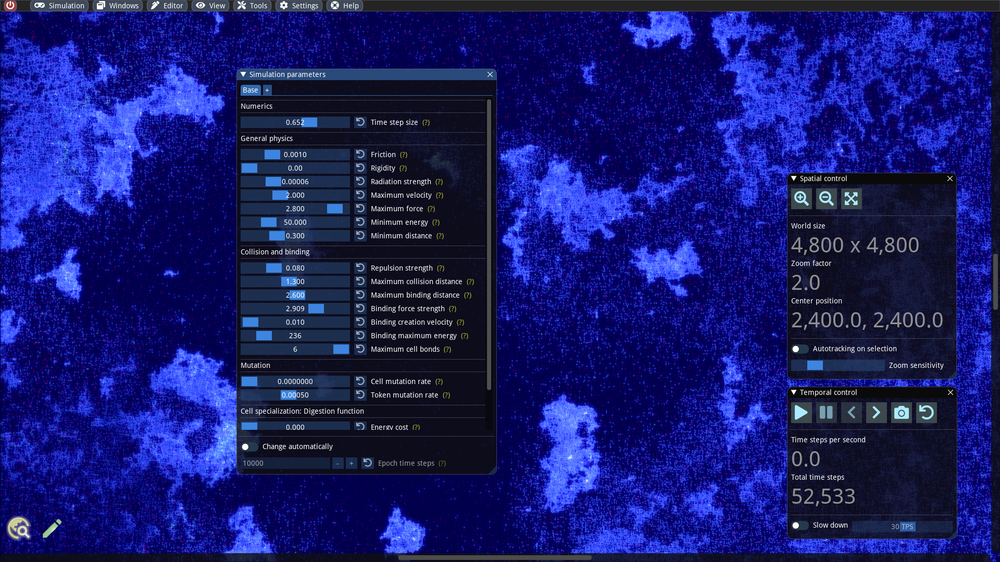

# Explore simulation parameters

#### Abstract

By adjusting simulation parameters we can customize the physical laws as well as cell functions and mutations. ALIEN offers the possibility to vary such parameters spatially as well as temporally. This allows us to create diversified worlds, which are especially interesting for evolutionary simulations because different parameters require different evolutionary adaptations. Here we want to explore some possibilities for setting simulation parameters and their effects

## Overview

The simulation `./examples/simulations/Complex Fluids.sim` is suitable for testing different parameter settings. We open the simulation parameters window and should see somewhat as follows:

In this window there is a tab widget with a default tab named _Base_. This tab contains the parameters which apply everywhere where no special spots have been set up. We will go into more detail about this, but so far we have not set up any spots. Furthermore, at the bottom of the window the toggle named _Change automatically_ can be used to vary the parameters in time.

Basically, changes to the parameters become active immediately and can also be carried out during a running simulation. By clicking the button next to the slider, the corresponding parameter can be reset to their initial state at any time.

## Adjust physical parameters

We would like to focus on a few physical parameters and describe their effect in the following. The other parameters responsible for mutations and cell functions we will explored later. We recommend running the loaded simulation, playing with the sliders of the associated parameters and applying forces with the mouse pointer to observe the effects.

* _Friction_: This value indicates how much the particles are decelerated in each time step. If this value is high, all movements quickly come to a halt. As a result, strong adaptive pressure is generated in evolutionary simulations, favoring individuals that are able to move quickly.
* _Rigidity_: Since ALIEN is based on a pure particle engine, rigid bodies cannot really be simulated. Nevertheless, in order to approximate rigid motions, an additional processing step can be switched on with this parameter, which requires some extra computation time (typically about 30%).
* _Radiation strength_: A high radiation leads to rapid energy losses of the cells and ultimately to their decay. If the radiation is too strong, stable structures cannot exist for a longer time and the simulation quickly reaches maximum entropy.
* _Maximum force_: If the force acting on a cell is greater than this value, the cell and their connections to neighboring cells will be destroyed. A high value consequently produces great amount of damage in an event of collisions.
* _Binding creation velocity_: When two cells collide, a new connection can be established if both cells still have a free space for a connection and the impact velocity exceeds a specific value that can be set with this parameter. It is easy to perceive that with a high value, the fluid in the simulation clumps very easily.
* _Binding maximum energy_: This value indicates up to what energy a cell can maintain connections. At very low values (below 100), most cell clusters break down into individual cells and all matter in the simulation behaves fluid-like.

## Worlds with spatially varying parameters
