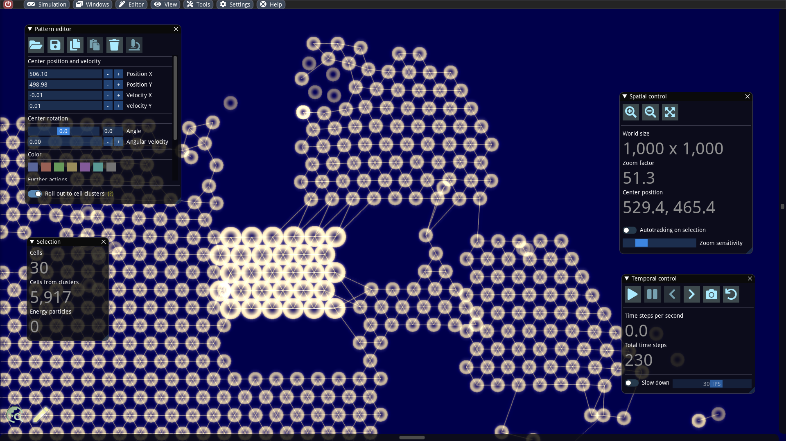

# First steps with the editor

#### Abstract

In this section, we will familiarize ourselves with some basic functions of the editor. The user has the possibility to directly intervene both in running and paused simulation. In the latter case, extensive editing features are available, a few of which will be mentioned here.

### Apply forces to objects in a running simulation

For testing purposes we load the simulation `./examples/simulations/physics/Sand Stones.sim`. In this simulation, we can try out pushing simple geometric objects around with the mouse cursor. We first zoom out a bit and switch from the navigation mode to the editor by clicking on the pencil icon at the bottom left (or alternatively via the _Editor_ menu and then by invoking _Activate_).

As soon as we have clicked on the play button, the simulation runs and we can exert force on the objects by holding down the left mouse button. The faster we move the mouse, the stronger the acting forces are.

### Select und move objects

After the simulation is paused, we can select objects and move them around by dragging and dropping with the left mouse button. Selected objects are generally highlighted with a higher brightness. If one wishes to extend the selection to several objects, one can accomplish this by holding down the CTRL key. It is also possible to select a whole area by dragging a rectangular box with the right mouse button pressed.

The Selection info window shows how many entities have been selected. A selection always consists of two levels: On the one hand the directly selected entities (cells and energy particles) and on the other hand the extended selection, which additionally contains the connected cells.

When a selection is shifted with the mouse, the extended selection is actually affected by default. This behavior can be changed with the toggle _Rollout to cell clusters_ in the _Pattern editor_. If it is turned off, only the immediate selection is affected by the editing actions. The toggle can also be switched off temporarily by holding down the SHIFT key. As one may notice after some experimentation, the cell clusters can be rewired when the switch is disabled. More precisely:

* If one moves a cell too far from its connected cell, the connection will be removed.
* If one brings a cell in the proximity of another cell and if both cells are capable of making connections, a new connection will be established.

### Reference versus current configuration

For an elastic solid, the reference configuration denotes the body in its undeformed state. In this situation, no internal forces act on individual parts. If external forces are applied to the body, it may deform over time and internal forces build up which want to bring the body into the reference configuration. This phenomenon is illustrated in the following.

If one moves cells in ALIEN without the associated cluster, one changes the lengths of and the angles between the connections. These changes apply only to the current configuration. The reference configuration remains unchanged. As a result, considerable internal stresses build up in some cases, which cannot be seen in the paused state. With the help of the _Release stresses_ function in the _Pattern editor_, the internal forces can be released by setting the reference configuration to the current configuration.

### Further useful editing functions

The _Pattern editor_ offers a variety of other editing operations, which are best tried out by oneself:

* Copy & paste of selections via CTRL + C and CRTL + V or the toolbar buttons.
* A slider can be used to rotate the selection as desired.
* Cells can be colored with one of 7 available color flavors. They do not play any role physically, but they can have a special meaning for cell functions.
* Speeds and rotational velocities can be updated. In addition, all particle velocities of a selection can be adjusted to the center velocity via the button _Set uniform velocities_.

