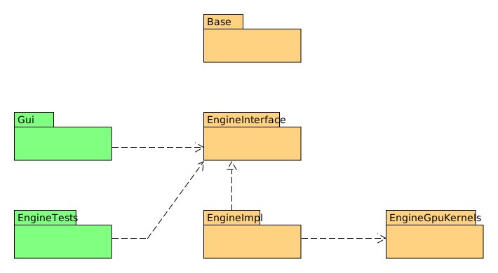

# Architecture

## Overview

At the coarsest level, the source code can be structured into targets (libraries and executables) and their dependencies. The _Base_ library is used by all others and therefore is not separately marked with dependency arrows.

## Engine

The main classes of the engine libraries and their relationships are shown in the following diagram. The CUDA code is completely encapsulated in the EngineGpuKernels library.

The data for the simulation consists of different sets of classes/structures on the CPU as well as GPU side. For the data transfer in both directions separate transfer objects (TOs) are used.

## GUI

