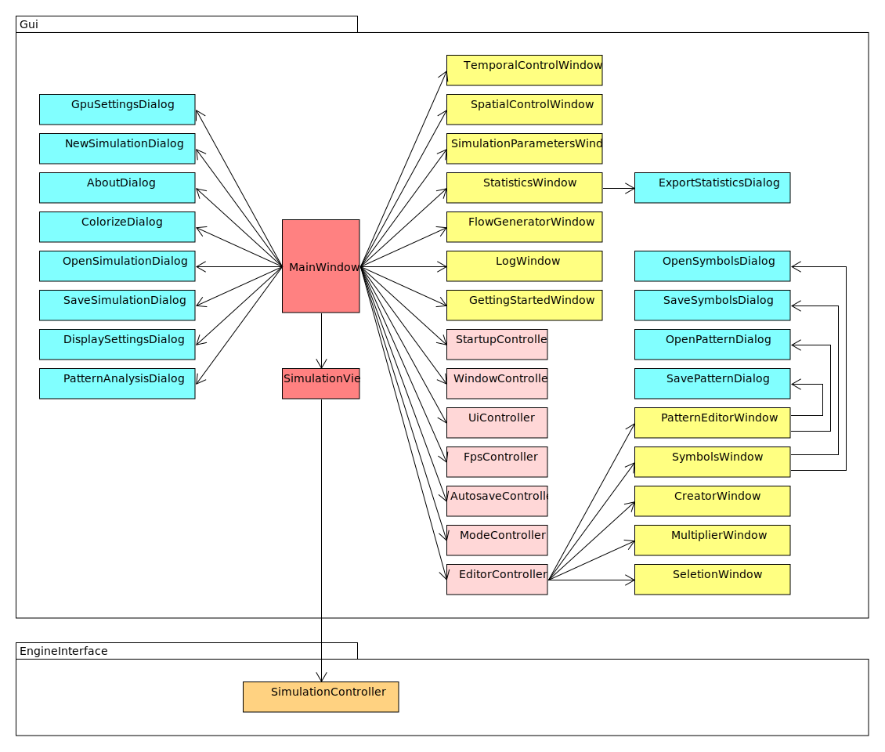

# Architecture

## Overview

At the coarsest level, the source code can be structured into targets (libraries and executables) and their dependencies. The graphical user interface and the engine are completely decoupled. For example, it would be possible to use a different backend instead of CUDA.

The `Base` library is used by all others and therefore is not separately marked with dependency arrows.&#x20;

## Engine

The main classes of the engine libraries and their relationships are shown in the following diagram. The CUDA code is completely encapsulated in the `EngineGpuKernels` library.

The data for the simulation consists of different sets of classes/structs on the CPU as well as GPU side. For the data transfer in both directions separate transfer objects (TOs) consisting of C arrays are used.

## GUI

The user interface is developed with [Dear Imgui](https://github.com/ocornut/imgui). All windows and dialogs that can be displayed are encapsulated in independent classes. The controller classes manage processes in the background or further windows. MVC patterns are not used in order not to unnecessarily bloat the code.

